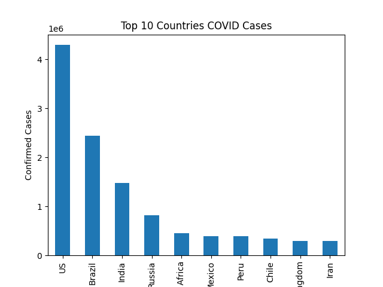

# COVID-19 Data Analysis

## Description
This project analyzes COVID-19 dataset using Python.

## Features
- Data loading using Pandas
- Data cleaning
- Top 10 countries analysis
- Visualization using Matplotlib

## Output

## Technologies
- Python
- Pandas
- Matplotlib
